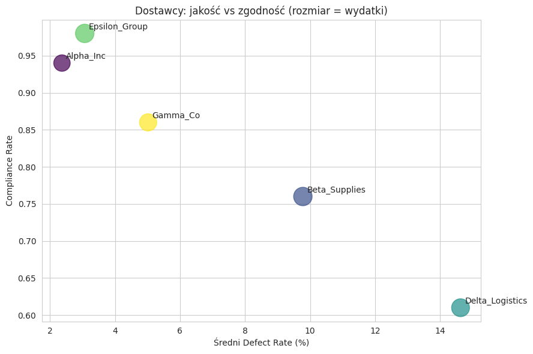

# Procurement Cost Analysis

Supplier performance, cost savings, and risk analysis for a procurement operation, using SQL, Python, and Power BI.



## Business Problem

A procurement department needs to understand which suppliers deliver the best value — not just the lowest price, but the right balance of cost savings, delivery reliability, product quality, and policy compliance. This project analyzes 776 purchase orders across 5 suppliers and 5 item categories to answer:

- Which suppliers generate the most savings, and at what quality/compliance cost?
- Where does risk (defects, cancellations, non-compliance) concentrate — in specific suppliers, specific categories, or both?
- Which supplier–category combinations need attention?

## Data Source

[Procurement KPI Analysis Dataset](https://www.kaggle.com/datasets/shahriarkabir/procurement-kpi-analysis-dataset) (Kaggle) — 777 purchase order records with supplier, pricing, delivery, defect, and compliance fields.

## Repository Structure

```
procurement-cost-analytics/
├── README.md
├── data/
│   ├── raw/                    # Original Kaggle dataset
│   └── processed/              # Cleaned dataset with engineered features
├── notebooks/
│   ├── 01_Data_Cleaning.ipynb  # Cleaning, validation, feature engineering
│   ├── 02_sql_analysis.ipynb   # SQLite analysis and query verification
│   └── figures/                # Exported charts + plotting scripts
├── sql/
│   ├── supplier_KPI.sql
│   ├── query_supplier_ranking.sql
│   ├── query_category_analysis.sql
│   └── query_supplier_category.sql
└── PowerBi/
    ├── Procurement cost analysis.pbix
    └── Procurement cost analysis.pdf
```

## Data Quality Notes

Before analysis, the raw data was checked for internal consistency rather than just missing values:

- **`Delivery_Date`**: 11.2% missing. Of those, most (68 of 87) belong to orders marked `Delivered` — while 198 non-`Delivered` orders *do* have a delivery date. This means `Delivery_Date` does not reliably represent an actual confirmed delivery event, and lead time was calculated accordingly (see notebook for the exact handling).
- **`Defective_Units`**: 17.5% missing, spread roughly evenly across order statuses — treated as missing at random rather than a systematic gap.
- One record had a delivery date earlier than its order date (logical impossibility) and was removed.
- **On-time delivery** is not directly available in the data (no promised/expected delivery date), so it was defined as: lead time ≤ the median lead time for that item category. This is a modeling choice, not a ground truth, and is documented here for transparency.

## Methodology

1. **Cleaning & feature engineering** (Python/pandas): date parsing, data quality flags, `Lead_Time_Days`, `Order_Value`, `Savings_Amount`, `Savings_Rate_%`, `Defect_Rate_%`, `Is_On_Time`.
2. **SQL analysis** (SQLite): supplier-level KPIs, supplier ranking via window functions (`RANK() OVER`), category-level analysis, and supplier × category cross-tabulation.
3. **Dashboard** (Power BI): interactive report with KPI cards, supplier ranking table, and a quality-vs-compliance risk view.

## Key Findings

- **Alpha_Inc and Epsilon_Group** are the strongest performers overall — lowest defect rates (2.4% and 3.1%) and highest compliance (94% and 98%) — with savings rates in line with everyone else. There's no cost/quality trade-off with these two.
- **Delta_Logistics** is the weakest supplier across every dimension measured: highest defect rate (14.6%), lowest compliance (61%), while still handling the second-highest order volume.
- Risk is driven more by **which supplier** is used than by **which category** is ordered — category-level metrics are fairly uniform (defect rates 6.3–7.9%), while supplier-level metrics vary widely (2.4–14.6%).
- **Beta_Supplies** looks average overall, but has a 19% cancellation rate specifically in the Electronics category — more than double any other supplier in that category. This only becomes visible when cutting the data by supplier *and* category together.

## Tools Used

- **Google Colab** — data cleaning, feature engineering, SQL analysis (SQLite), and visualization (Python/pandas/matplotlib/seaborn)
- **SQL (SQLite)** — KPI aggregation, window functions, cross-tabulation
- **Power BI Desktop** — interactive dashboard

## Reproducing This Analysis

1. Open `notebooks/01_Data_Cleaning.ipynb` in Google Colab, upload `data/raw/procurement_kpi_dataset.csv`, and run all cells to produce the cleaned dataset.
2. Open `notebooks/02_sql_analysis.ipynb`, upload the cleaned CSV, and run all cells to reproduce the SQL analysis and charts.
3. Open `PowerBi/Procurement cost analysis.pbix` in Power BI Desktop to explore the interactive dashboard (or view `Procurement cost analysis.pdf` for a static version).

## Author

Szymon Pawłowski — [GitHub](https://github.com/szymonp311203) | [LinkedIn](https://www.linkedin.com/in/szymon-paw%C5%82owski-83a342309/)
